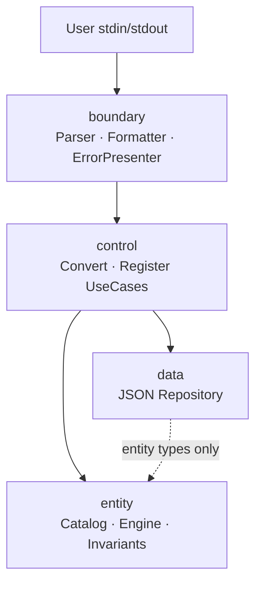

# Unit Converter (C++)

**meter 허브 기준 길이 단위 변환 CLI** — C++17·클린 아키텍처(BCE)·Catch2 TDD를 학습하는 개발자를 위해, **계약·테스트·레이어 분리**로 확장 가능한 구조를 익히는 교육용 프로젝트입니다.


## 목차

- [개요 (Overview)](#개요-overview)
- [빠른 시작 (Quick Start)](#빠른-시작-quick-start)
- [지원 단위 및 비율](#지원-단위-및-비율)
- [입력 형식 계약](#입력-형식-계약)
- [아키텍처](#아키텍처)
- [테스트 실행](#테스트-실행)
- [RED 단계 To-Do 리스트](#red-단계-to-do-리스트)
- [설정 파일 (JSON)](#설정-파일-json)
- [출력 포맷](#출력-포맷)
- [비목표 (Non-Goals)](#비목표-non-goals)
- [인수 기준 (AC)](#인수-기준-ac)
- [기여 가이드 (Contributing)](#기여-가이드-contributing)
- [라이선스](#라이선스)
- [관련 문서](#관련-문서)

---

## 개요 (Overview)

### 해결하는 문제

`단위:값` 한 줄로 meter·feet·yard 등 길이를 변환하는 프로그램은 동작하기 쉽지만, 비율·분기·출력이 한 파일에 묶이면 **단위 추가·포맷 변경·설정 분리** 때마다 수정 범위를 예측하기 어렵습니다. “숫자가 맞는 것 같다”만으로는 요구(OCP/SRP·검증·외부 설정)를 **지속적으로 증명**할 수 없습니다.

### 주요 학습 목표

| 목표 | 내용 |
|------|------|
| **OCP** | 신규 단위·출력 포맷 추가 시 환산 루프·`if (unit==...)` 확장 최소화 |
| **SRP** | Parser / Formatter / Catalog / Engine / Repository / ErrorPresenter 책임 분리 |
| **BCE** | Boundary · Control · Entity · Data 레이어와 의존성 방향 준수 |
| **TDD** | Catch2 RED→GREEN→REFACTOR; Gherkin·ERR 코드로 계약 고정 |

### PRD와의 연결

요구·인수 기준·회귀 LOCK의 **정본**은 [docs/PRD.md](docs/PRD.md) v1.1 입니다. 구현·테스트·README 문구는 PRD §3(기능 계약)·§6(출력)·§7(AC·LOCK)과 일치해야 합니다.

> **인수 정본:** BCE 구조(`src/`) + Catch2 + `config/units.json`  
> **학습 출발점:** 루트의 `UnitConverter.cpp`(레거시, 단일 파일)

### 측정 목표 (PRD G-01~G-07)

| ID | 목표 | 통과 |
|----|------|------|
| G-01 | 커버리지 | entity≥95%, boundary≥85%, data≥90%, control≥80%, overall≥88% |
| G-02 | 계약 테스트 | DT/BT/IT 0 실패; Gherkin Sc.1~13 |
| G-03 | 환산 정확도 | ε≤1e-9; meter:2.5→feet 8.2, yard 2.7 |
| G-04 | 회귀 LOCK | LOCK 변경 시 TC·Gherkin 동시 갱신 |
| G-05 | 동적 확장 | cubit 등록 후 변환 N+1줄 |
| G-06 | 실습 완료 | Activities 1~5 + AC 달성표 |
| G-07 | BCE·OCP | 4레이어; if-체인 0; entity include 0 |

---

## 비목표 (Non-Goals)

| ID | 하지 않음 |
|----|-----------|
| NG-01 | GUI·REST·모바일 |
| NG-02 | 길이 외 물리량 변환 |
| NG-03 | 상용 SLA·원격 CI 정의 |
| NG-04 | 환산 알고리즘 연구(계약 준수가 목적) |
| NG-05 | 레거시 cpp를 인수 정본으로 사용 |

---

## 빠른 시작 (Quick Start)

### 사전 조건

| 항목 | 요구 |
|------|------|
| 컴파일러 | C++17 이상 (GCC 9+, Clang 10+, MSVC 2019+) |
| 빌드 (목표) | CMake 3.16+ |
| 테스트 (목표) | Catch2 3.0+ |
| 레거시만 사용 시 | g++ 단일 컴파일 가능 |

### 레거시 프로토타입 (학습 Act.1 — 분석용)

저장소에 포함된 단일 파일 버전입니다. **PRD 계약(1자리 반올림·Error JSON·설정 파일)과 다를 수 있습니다.**

```bash
g++ -std=c++17 -o UnitConverter UnitConverter.cpp
./UnitConverter
```

프롬프트에 입력:

```text
meter:5.0
```

예시 출력 (레거시 — 반올림·포맷 미적용):

```text
5 meter = 5 meter
5 meter = 16.4042 feet
5 meter = 5.46805 yard
```

### 목표 빌드 (BCE + Catch2 — PRD 정본)

`src/`, `tests/`, `CMakeLists.txt` 구성 후 아래를 사용합니다. (구현 진행 시 [docs/TODO.md](docs/TODO.md) M1~M2 참고)

```bash
cmake -S . -B build -DCMAKE_BUILD_TYPE=Debug
cmake --build build
ctest --test-dir build --output-on-failure
./build/unit_converter
```

PRD **공식 검증 예** (`table`, ROUND-LOCK 1자리):

```text
meter:2.5
```

```text
2.5 meter = 2.5 meter
2.5 meter = 8.2 feet
2.5 meter = 2.7 yard
```

추가 예 (`meter:5.0` → feet `16.4`, yard `5.5`).

---

## 지원 단위 및 비율

모든 환산은 **meter 허브**(`factorToMeter`)를 기준으로 합니다. 내부 비교 허용 오차 **ε = 1e-9**.

| 표시명 | 식별자 (입력) | factorToMeter | 출처 |
|--------|---------------|---------------|------|
| meter | `meter` | 1.0 | PRD §5.1 · 기준 단위 |
| feet | `feet` | 3.28084 | PRD §5.1 · 1 m = 3.28084 ft |
| yard | `yard` | 1.09361 | PRD §5.1 · 1 m = 1.09361 yd |

**환산식**

```text
canonical     = inputValue × factorToMeter(sourceUnit)
targetValue   = canonical ÷ factorToMeter(targetUnit)
```

feet ↔ yard는 반드시 meter 경유값과 일치해야 합니다 (ε-LOCK).

---

## 입력 형식 계약

### 정상 입력 (CONVERT)

형식: `{unit}:{value}`

- `unit`: `[a-z][a-z0-9_]*` (소문자만)
- `value`: 10진 `stod` 성공 토큰; `0` 허용

### 음수·0 정책 (NEG-POLICY)

> **NEG-POLICY-01:** `value < 0` → exit `1`, `ERR-DOMAIN-NEGATIVE-LENGTH`, `Negative length not allowed: {value}`  
> **NEG-POLICY-02:** `value = 0` → 허용, 전 단위 `0.0` 출력

| 예시 | 설명 |
|------|------|
| `meter:2.5` | 기준 단위에서 변환 |
| `feet:3.28084` | 비기준 단위; LHS `3.3 feet =` (ROUND-LOCK) |
| `yard:0` | 전 단위 `0.0` 출력 |

### 동적 등록 (REGISTER, 권장)

```text
1 cubit = 0.4572 meter
```

성공 시: `registered: cubit = 0.4572 meter` (exit 0)

| 실패 | code / 결과 |
|------|-------------|
| 형식 불일치 | `ERR-PARSE-REGISTER` — `Invalid register format. Use 1 unit = factor meter` |
| factor ≤ 0 | `INVALID_FACTOR` |
| 중복 unit | `DUPLICATE_UNIT` |

### 비정상 입력 — 대표 3건

| 입력 | exit | code | message (전체 일치) |
|------|------|------|---------------------|
| `meter2.5` (`:` 없음) | 1 | `ERR-PARSE-FORMAT` | `Invalid format. Use unit:value (ex: meter:2.5)` |
| `meter:2,5` (숫자 아님) | 1 | `ERR-PARSE-NUMBER` | `Invalid number: 2,5` |
| `meter:-1` (음수) | 1 | `ERR-DOMAIN-NEGATIVE-LENGTH` | `Negative length not allowed: -1` |

추가: 빈 줄 → `ERR-PARSE-EMPTY` / `Empty input.` · 미등록 `inch:1` → `ERR-DOMAIN-UNKNOWN-UNIT` / `Unknown unit: inch` · `Meter:2.5` → `ERR-PARSE-FORMAT`

### stderr Error JSON (실패 공통)

| 필드 | 필수 | 설명 |
|------|------|------|
| `code` | Y | `ERR-PARSE-*`, `ERR-DOMAIN-*`, `ERR-DATA-*` |
| `message` | Y | §3.2 패턴 **전체 일치** (MESSAGE-LOCK) |
| `field` | N | `unit`, `value`, `path` |

```json
{"code":"ERR-DOMAIN-UNKNOWN-UNIT","message":"Unknown unit: inch","field":"unit"}
```

- stdout 변환 줄: **0줄** · table / json / csv 동일

---

## 아키텍처

### BCE 레이어 (Mermaid)



### 의존성 방향

| 허용 | 금지 |
|------|------|
| boundary → control | entity → boundary |
| control → entity | entity → data |
| control → data (Port) | data → boundary |
| data → entity (타입만) | main/parser에 `if (unit=="feet")` 체인 |

### 새 단위 추가 (코드 변경 최소화)

1. **설정:** `config/units.json`에 `{ "name": "mile", "factorToMeter": 1609.34 }` 추가 (선택)
2. **또는 런타임:** `1 mile = 1609.34 meter` REGISTER 입력
3. **확인:** `UnitCatalog` 등록 수 +1; CONVERT 시 출력 줄 수 N+1
4. **금지:** 환산 `if-else` 분기 추가 — Catalog 순회만 사용 (F-09)
5. **테스트:** DT(ε) + BT(출력 줄 수·ORDER-LOCK) + IT 1건 추가

Entity·환산식 파일은 **수정하지 않는 것**이 목표(OCP)입니다.

### 디렉터리 (목표 구조)

```text
src/entity/      # 순수 도메인
src/control/     # 유스케이스
src/boundary/    # CLI · 파싱 · 포맷
src/data/        # 설정 로드
tests/unit/      # Catch2
tests/integration/
config/units.json
```

---

## 테스트 실행

| 항목 | 값 |
|------|-----|
| 프레임워크 | Catch2 3.0+ |
| 패턴 | AAA (Arrange · Act · Assert) |
| 정본 시나리오 | PRD §9.1 Gherkin Sc.1~13 · [docs/gherkin.md](docs/gherkin.md) |
| 레이어 | DT (entity) · BT (boundary) · IT (통합) — **100% PASS** (G-02) |

```bash
cmake -S . -B build
cmake --build build
ctest --test-dir build --output-on-failure
# 커버리지: gcov 또는 llvm-cov (G-01·AC-08 게이트)
```

### 커버리지 목표 (G-01 · AC-08)

| 레이어 | 최소 |
|--------|------|
| entity | 95 |
| boundary | 85 |
| data | 90 |
| control | 80 |
| **overall** | **88** |

미달 시 릴리스·인수 완료 선언하지 않습니다.

---

## RED 단계 To-Do 리스트

> 이 체크리스트는 @docs/test_plan.md 기반으로 생성되었습니다.
> 각 항목은 RED(실패 테스트 작성) 완료 시 체크합니다.

### Track A — UI / Boundary 테스트
- [ ] TC-A-01: 정상 입력 "meter:2.5" → 변환 결과 반환 (Happy Path)
- [ ] TC-A-02: ":" 없는 입력 → std::invalid_argument 발생
- [ ] TC-A-03: 음수 입력 "meter:-1.0" → std::invalid_argument 발생
- [ ] TC-A-04: 없는 단위 "parsec:1.0" → std::invalid_argument 발생
- [ ] TC-A-05: 소수점 파싱 실패 "meter:abc" → std::invalid_argument 발생
- [ ] TC-A-06: 출력 포맷에 원 입력 단위·값 보존 ("2.5 meter = ...")
- [ ] TC-A-07: value=0 경계값 처리 확인

### Track B — Domain / Logic 테스트
- [ ] TC-B-01: convert("meter", 2.5, "feet") == 8.20210 (오차 1e-5)
- [ ] TC-B-02: convert("meter", 1.0, "yard") == 1.09361 (오차 1e-5)
- [ ] TC-B-03: convert("feet", 1.0, "meter") == 0.30480 (역변환)
- [ ] TC-B-04: convertAll("meter", 1.0) → 모든 등록 단위 변환 반환
- [ ] TC-B-05: registerUnit("cubit", 0.4572) 후 변환 가능
- [ ] TC-B-06: loadConfig(유효한 경로) → 비율 정상 로드
- [ ] TC-B-07: loadConfig(없는 경로) → 기본값(3.28084/1.09361) 유지

### 커버리지 목표
- [ ] Domain Logic: 95%+ (# gcov / lcov)
- [ ] Boundary Layer: 85%+
- [ ] 전체 TOTAL: 90%+

### 결함 목록 연결
- [x] [defect_list.md](docs/defect_list.md) 생성 및 발견 결함 기록 (DEF-001~009)
- [x] 모든 결함 수정 후 회귀 테스트 통과 확인 (`ctest` 4/4 PASS)

---

## 설정 파일 (JSON)

**위치:** `config/units.json` (기동 시 로드, JSON이 정본 · YAML은 v2 선택)

**스키마 예시:**

```json
{
  "units": [
    { "name": "meter", "factorToMeter": 1.0 },
    { "name": "feet",  "factorToMeter": 3.28084 },
    { "name": "yard",  "factorToMeter": 1.09361 }
  ]
}
```

| 규칙 | 내용 |
|------|------|
| 필수 | `meter` 존재, `factorToMeter` = 1.0 |
| 실패 | 파일 없음·깨진 JSON·**중복 unit name**·**factor≤0** → exit 1, `ERR-DATA-LOAD`, `Failed to load unit config: {path}` |

### 동적 단위 등록 (런타임)

| 항목 | 계약 |
|------|------|
| 문법 | `1 {unit} = {factor} meter` |
| factor | 양수만 |
| 성공 | `registered: {unit} = {factor} meter` |
| 예시 | `1 cubit = 0.4572 meter` → 이후 `cubit:1` → meter 약 `0.5` (1자리) |

---

## 출력 포맷

공통: **소수 1자리**, half-away-from-zero (ROUND-LOCK). **SRC-LOCK:** `sourceUnit` 입력 그대로; **sourceValue** = ROUND(입력). **ORDER-LOCK:** 줄 순서 = 카탈로그 등록 순.

### 콘솔 (table, 기본)

```text
{sourceValue} {sourceUnit} = {targetValue} {targetUnit}
```

`meter:2.5` 예:

```text
2.5 meter = 2.5 meter
2.5 meter = 8.2 feet
2.5 meter = 2.7 yard
```

### JSON (`format=json`)

```json
{
  "source": { "unit": "meter", "value": 5.0 },
  "conversions": [
    { "unit": "meter", "value": 5.0 },
    { "unit": "feet",  "value": 16.4 },
    { "unit": "yard",  "value": 5.5 }
  ]
}
```

### CSV (`format=csv`)

```csv
source_unit,source_value,target_unit,target_value
meter,5.0,meter,5.0
meter,5.0,feet,16.4
meter,5.0,yard,5.5
```

---

## 인수 기준 (AC)

PRD §7.1 · [docs/traceability-matrix.md](docs/traceability-matrix.md)

| AC | 요약 | Activities |
|----|------|------------|
| AC-01 | 형식·숫자·음수 거절 | Act.2~3 |
| AC-02 | meter:2.5 table 8.2/2.7 | Act.2 |
| AC-03 | unknown unit | Act.2 |
| AC-04 | config 실패 | Act.4 |
| AC-05 | json 스키마 | Act.4 |
| AC-06 | cubit 등록 | Act.4 |
| AC-07 | BCE·if-체인 0 | Act.2 |
| AC-08 | 커버리지 % (G-01) | Act.3~4 |
| AC-09 | 빈 줄 | Act.3 |
| AC-10 | meter:0 | Act.3 |
| AC-11 | csv | Act.4 |
| AC-12 | REGISTER 실패 3종 | Act.4 |
| AC-13 | Error JSON exact | Act.3 |

---

## 기여 가이드 (Contributing)

### 계약 변경 금지 원칙 (PRD §7.2 LOCK)

| LOCK | 고정 내용 |
|------|-----------|
| ε-LOCK | factorToMeter 3값, ε=1e-9 |
| ROUND-LOCK | 1자리 half-away-from-zero |
| MESSAGE-LOCK | §입력 계약 message 패턴 전체 |
| ORDER-LOCK | 출력 순서 = 카탈로그 등록 순 |
| NEG-LOCK | 음수 거절 · 0 허용 |
| SRC-LOCK | LHS unit=입력; LHS value=ROUND(입력) |

LOCK 변경 시 PRD 버전 bump + Catch2 + Gherkin **동시 PR** (PRD §7.2).

**금지:** 소스에 비율 리터럴 3.28084/1.09361 (F02) · `catch(...)` 삼키기 (F03) · entity→boundary include (F07).

### 테스트 없는 PR 거부

- 신규 동작: **Catch2 RED → GREEN** 순서
- Domain 로직 없이 Boundary만 통과하는 PR 금지
- 테스트 삭제·완화·`DISABLE`로 통과 처리 금지

### 커밋 메시지 컨벤션

```text
<type>(<scope>): <subject>

type: feat | fix | test | refactor | docs | chore
scope: entity | boundary | control | data | config
subject: 50자 이내, 명령형 현재형 (영문 또는 한글 일관)

예: feat(entity): add UnitCatalog register with duplicate guard
예: test(boundary): lock ERR-PARSE-NUMBER message for meter:2,5
```

코딩 스타일: `.cursorrules` · clang-format LLVM. Entity는 boundary/data 헤더를 include하지 않습니다.

---

## 라이선스

MIT License — **학습·실습·포크 자유**. 상용 재배포 시에도 LICENSE 문구를 유지하세요.

---

## 관련 문서

| 문서 | 설명 |
|------|------|
| [docs/PRD.md](docs/PRD.md) | 요구 정본 · AC-01~13 |
| [docs/TODO.md](docs/TODO.md) | TD-01~25 · 마일스톤 |
| [docs/traceability-matrix.md](docs/traceability-matrix.md) | Story ↔ To-Do ↔ PRD |
| [docs/gherkin.md](docs/gherkin.md) | Gherkin Sc.1~13 |
| [docs/test_plan.md](docs/test_plan.md) | 테스트 계획 · RED 체크리스트 |
| [docs/defect_list.md](docs/defect_list.md) | RED 결함 목록 · TC 추적 |
| [.cursorrules](.cursorrules) | BCE · TDD · forbidden |

### 6시간 실습 Activities (요약)

| # | 시간 | 내용 |
|---|------|------|
| 1 | 0.5h | 레거시 분석 · 계약 정리 |
| 2 | 2h | BCE + 입력 검증 (필수) |
| 3 | 0.5h | Catch2 TC |
| 4 | 2h | 설정 · 등록 · json/csv (권장) |
| 5 | 1h | 회고 · PRD AC 달성도 |

---

*README ↔ PRD v1.1 부록 C 전항목(✅) 동기화 · 구현은 `src/`+Catch2 완료 시 인수*
