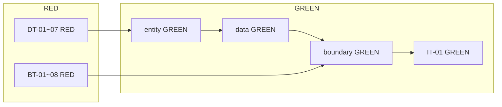

# 테스트 계획서 — UnitConverter_09

| 항목 | 내용 |
|------|------|
| **문서 버전** | 1.0 |
| **작성** | 시니어 QA 리드 · Step 02 샘플 기준 |
| **정본** | [PRD.md](PRD.md) v1.1 · [README.md](../README.md) · [.cursorrules](../.cursorrules) |
| **기술 스택** | C++17 · CMake · Catch2 3.x |
| **워크플로** | Dual-Track TDD · RED → GREEN → REFACTOR (리팩토링 우선) |
| **갱신일** | 2026-05-21 |

---

## 1. 범위 및 앵커 샘플

### 1.1 앵커 기능 (Step 02 선정)

| 항목 | 내용 |
|------|------|
| **기능명** | CONVERT — meter 기준 다중 단위 변환 (table 포맷) |
| **요구 참조** | PRD **F-01** · **AC-02** · **G-03** · Gherkin **Sc.1** |
| **입력** | `meter:2.5` |
| **기대 stdout (exit 0, N=3)** | 아래 3줄 **문자열 전체 일치** (ROUND-LOCK · SRC-LOCK · ORDER-LOCK) |

```text
2.5 meter = 2.5 meter
2.5 meter = 8.2 feet
2.5 meter = 2.7 yard
```

**내부 환산 검증 (ε-LOCK, DT):**

- `canonical = 2.5 × 1.0 = 2.5` m  
- feet: `2.5 ÷ 3.28084` → 표시 `8.2` (factor **3.28084**, 1 m = 3.28084 ft)  
- yard: `2.5 ÷ 1.09361` → 표시 `2.7` (factor **1.09361**, 1 m = 1.09361 yd)  
- 엔진 비교 허용 오차: **ε = 1e-9**

### 1.2 본 계획서 범위

| 포함 | 제외 |
|------|------|
| 앵커 샘플 및 동일 F-01/F-02 계열 경계·실패 | REGISTER 성공(cubit) 상세 시나리오 (Should, TD-13 별도 스위트) |
| Catch2 단위·통합 테스트 설계 | GUI·네트워크 (PRD NG-01) |
| 경계값·예외·커버리지·gcov 전략 | 레거시 `UnitConverter.cpp` 인수 정본화 (NG-05) |

### 1.3 Dual-Track 매핑

| Track | 레이어 | 테스트 접두 | 본 샘플에서의 역할 |
|-------|--------|-------------|-------------------|
| **Logic** | entity → data → control | **DT** · **DAT** · (control) | 환산식·ε·ROUND 전 단계·카탈로그 N |
| **UI** | boundary | **BT** | 파싱·포맷·stderr JSON·exit |
| **E2E** | boundary+control+entity+data | **IT** | `meter:2.5` CLI 한 줄 end-to-end |

---

## 2. Catch2 단위 테스트 — 범위 및 우선순위

### 2.1 디렉터리·네이밍

```
tests/
├── unit/
│   ├── entity/      # DT-*
│   ├── data/        # DAT-*
│   ├── control/     # CT-* (얇은 오케스트)
│   └── boundary/    # BT-*
└── integration/     # IT-*
```

- **패턴:** AAA (Arrange–Act–Assert)  
- **이름:** `Layer_Scenario_ExpectedOutcome` (예: `DT_ConvertMeter25_FeetDisplay82`)  
- **부동소수:** `REQUIRE_THAT(..., Catch::Matchers::WithinAbs(expected, 1e-9))`  
- **문자열·exit:** MESSAGE-LOCK / ROUND-LOCK — `REQUIRE` **전체 일치**

### 2.2 우선순위 정의

| 우선순위 | 의미 | RED 순서 (.cursorrules) |
|----------|------|-------------------------|
| **P0** | 앵커·인수 차단 — RED 없이 다음 단계 불가 | entity → data → boundary → integration |
| **P1** | 동일 기능군 확장·AC 직결 | control, 나머지 BT/IT |
| **P2** | Should·회귀·리팩터 게이트 | json/csv, REGISTER, 커버리지 스냅샷 |

### 2.3 P0 — Logic Track (entity / data)

| ID | TEST_CASE (안) | 검증 요약 | AC/LOCK |
|----|----------------|-----------|---------|
| DT-01 | `DT_ConvertMeter25_CanonicalAndFeet` | `meter:2.5` → canonical 2.5 m, feet 내부값 ε, **표시 8.2** | AC-02, G-03, ε-LOCK |
| DT-02 | `DT_ConvertMeter25_YardDisplay27` | yard target **2.7** | AC-02, ROUND-LOCK |
| DT-03 | `DT_ConvertMeter25_SelfLine25` | meter→meter **2.5** | SRC-LOCK |
| DT-04 | `DT_HubFactors_FeetYardFromMeter` | factor 3.28084 / 1.09361 단일 출처(INV-D08), 리터럴 엔진 외 금지 | F02, ε-LOCK |
| DT-05 | `DT_ConvertMeter0_AllTargetsZero` | value=0 → 전 target **0.0** (엔진) | AC-10, F-07, NEG-POLICY-02 |
| DT-06 | `DT_CatalogSize_EqualsOutputCount` | N=3 → 변환 결과 3건 | INV-D05, F-01 |
| DT-07 | `DT_OrderLock_RegistrationOrder` | 출력 순서 = 등록 순 (meter, feet, yard) | ORDER-LOCK, TD-16 |
| DAT-01 | `DAT_LoadUnitsJson_ThreeFactors` | `config/units.json` 3비율 로드 | F-04, Background |

**P0 구현 원칙:** Domain 테스트에 stdin·파일·JSON 문자열 **유입 금지** — `DefaultUnitCatalogFixture`로 catalog 주입.

### 2.4 P0 — UI Track (boundary)

| ID | TEST_CASE (안) | 검증 요약 | AC/LOCK |
|----|----------------|-----------|---------|
| BT-01 | `BT_ConvertMeter25_TableThreeLines` | stdout 3줄 스냅샷 (앵커 전문) | AC-02, Sc.1 |
| BT-02 | `BT_ConvertMeter25_LhsSrcLock` | 모든 줄 `2.5 meter =` 접두 | SRC-LOCK |
| BT-03 | `BT_ConvertMeter0_TableAllZero` | `meter:0` → N줄 `0.0` | AC-10, Sc.10 |
| BT-04 | `BT_ParseNoColon_ErrFormat` | `meter2.5` → exit 1, ERR-PARSE-FORMAT, message exact | AC-01, Sc.3 |
| BT-05 | `BT_ParseNonNumber_ErrNumber` | `meter:abc` → ERR-PARSE-NUMBER `Invalid number: abc` | AC-01 |
| BT-06 | `BT_ParseNegative_ErrDomain` | `meter:-1` → ERR-DOMAIN-NEGATIVE-LENGTH | AC-01, NEG-POLICY-01 |
| BT-07 | `BT_UnknownUnit_Parsec` | `parsec:1.0` → ERR-DOMAIN-UNKNOWN-UNIT, stdout **0줄** | AC-03, Sc.6 |
| BT-08 | `BT_ErrorJson_StderrExact` | 실패 시 stderr JSON 1줄 `code`·`message` | AC-13 |

**Fixture:** `CaptureStdoutStderrFixture` — F01 금지( entity에 cout 없음).

### 2.5 P1 — control · integration

| ID | TEST_CASE (안) | 검증 요약 |
|----|----------------|-----------|
| CT-01 | `CT_ConvertUseCase_DelegatesToEngine` | Control은 오케스트만, 환산식 없음 |
| IT-01 | `IT_Meter25_Exit0_TableSnapshot` | 기동→`meter:2.5`→exit 0·3줄 (E2E) |
| IT-02 | `IT_Meter0_Exit0_AllZeroLines` | `meter:0` E2E |

### 2.6 P2 — 확장 (Should, 별도 마일스톤)

| ID | 내용 | TD |
|----|------|-----|
| BT-14~15 | json / csv format | TD-14, TD-15 |
| BT-18 | REGISTER 실패 3종 | TD-18 |
| IT-03~08 | 설정 실패·ORDER·feet:3.28084 LHS 3.3 | TD-04, TD-17 |

### 2.7 RED → GREEN 실행 순서 (앵커 스위트)



- **RED:** 신규 TC **전부 실패**가 정상.  
- **GREEN:** TC **1건(또는 동일 Invariant 묶음)** 씩 — 앵커는 **DT-01 → BT-01 → IT-01** 순 권장.  
- **금지:** Logic RED 없이 BT만 GREEN · 테스트 skip/삭제 · Invariant 변경으로 통과.

---

## 3. 경계값 케이스 목록

앵커 `meter:2.5`와 **동일 CONVERT·F-02 파이프라인**에서 검증한다.

| # | 분류 | 입력 | 기대 exit | 기대 code / message (요지) | stdout 변환 줄 | 주 테스트 ID | PRD/AC |
|---|------|------|-----------|---------------------------|----------------|--------------|--------|
| B-01 | **Happy** | `meter:2.5` | 0 | — | 3줄, feet `8.2`, yard `2.7` | DT-01~03, BT-01, IT-01 | AC-02, Sc.1 |
| B-02 | **영값** | `meter:0` | 0 | — | N줄, 모든 target `0.0`, LHS `0 meter` | DT-05, BT-03, IT-02 | AC-10, F-07, Sc.10 |
| B-03 | **매우 큰 수** | `meter:1e100` (또는 `stod` 성공 상한 근처) | 0 또는 1 | 아래 §3.1 | 계산 결과 유한·표시 1자리 또는 parse 실패 | DT-08, BT-09 | 리스크 기반 |
| B-04 | **음수** | `meter:-1` | 1 | `ERR-DOMAIN-NEGATIVE-LENGTH` · `Negative length not allowed: -1` | **0줄** | BT-06 | AC-01, NEG-POLICY-01 |
| B-05 | **숫자 파싱 실패** | `meter:abc` | 1 | `ERR-PARSE-NUMBER` · `Invalid number: abc` | 0줄 | BT-05 | AC-01 |
| B-06 | **형식 오류 (`:` 없음)** | `meter2.5` | 1 | `ERR-PARSE-FORMAT` · `Invalid format. Use unit:value (ex: meter:2.5)` | 0줄 | BT-04 | AC-01, Sc.3 |
| B-07 | **미등록 단위** | `parsec:1.0` | 1 | `ERR-DOMAIN-UNKNOWN-UNIT` · `Unknown unit: parsec` | 0줄 | BT-07 | AC-03, Sc.6 |

### 3.1 B-03 매우 큰 수 — 계약·QA 판정

PRD는 `value`를 **10진 `stod` 성공 토큰**으로만 정의하며, 명시적 overflow 상한은 없다. QA는 다음 **2단**으로 기록한다.

| 단계 | 조건 | 기대 |
|------|------|------|
| **B-03a** | `stod` 성공·`value ≥ 0`·미등록 아님 | `canonical = value × factor`가 `double`에서 **inf/nan이 아님** → Formatter가 1자리 ROUND 후 유한 문자열 |
| **B-03b** | `stod` 실패 (예: 토큰 초과) | exit **1**, `ERR-PARSE-NUMBER`, 변환 0줄 |

**권장 입력 예:** `meter:1e308`, `meter:1e100` (환경별 `stod` 한계 확인).  
**실패 시:** 버그가 아니라 **계약 보완 PR** — PRD·TC·Gherkin 동시 갱신 (LOCK 정책).

### 3.2 경계값 부가 (앵커 스위트 인접)

| 입력 | 기대 | ID |
|------|------|-----|
| `meter:2,5` | ERR-PARSE-NUMBER | BT-05b |
| `` (빈 줄) | ERR-PARSE-EMPTY | BT-10 |
| `Meter:2.5` | ERR-PARSE-FORMAT (대문자 unit) | BT-11, C-04 |
| `inch:1` | ERR-DOMAIN-UNKNOWN-UNIT (PRD 정본 예) | BT-07b |

---

## 4. 예외·특이 케이스 목록

| # | 케이스 | 설명 | 검증 포인트 | 테스트 |
|---|--------|------|-------------|--------|
| E-01 | **stderr Error JSON** | 실패 시 stdout 0줄 + stderr 1줄 JSON | `code`, `message` exact; `field`는 unit/value/path 해당 시만 | BT-08 |
| E-02 | **ROUND vs SRC** | LHS `sourceValue` = ROUND(입력); `feet:3.28084` → `3.3 feet =` | SRC+ROUND 동시 (Sc.2) | DT-09, BT-12, TD-17 |
| E-03 | **ε-LOCK 허브 경유** | feet↔yard 직접 분기 금지, meter 경유 일치 | 교차 환산 DT | DT-10 |
| E-04 | **if-체인 금지 (F-09)** | `if (unit=="feet")` 0건 | 정적 검토 + 신규 단위 추가 시 루프 시그니처 불변 | 리뷰 + DT-11 |
| E-05 | **설정 로드 실패** | json 없음/깨짐/중복/factor≤0 | exit 1, ERR-DATA-LOAD, **프롬프트 없음** | DAT-02, IT-04 |
| E-06 | **에러 후 table/json/csv 동일** | 포맷 무관 stdout 0줄 | C-05 | BT-08 + format SECTION |
| E-07 | **catch(...) 삼키기 금지** | F03 — boundary에서만 매핑 | 예외 타입별 ERR-* | BT-13 |
| E-08 | **비율 리터럴 금지 (F02)** | 3.28084는 `units.json`/UnitDefinition만 | grep + DT factor 출처 | DAT-01, 정적 |
| E-09 | **레거시 cpp 이중 정본** | `UnitConverter.cpp` ≠ BCE 인수 | 레거시는 Act.1 참고만; **게이트는 `src/`** | 커버리지 §6.3 |
| E-10 | **가짜 GREEN** | hard-coded 8.2 반환 | Catalog+Engine 경유 IT/DT 동시 | DT-01 + IT-01 |

---

## 5. 커버리지 목표

PRD **G-01** · `.cursorrules` `testing.coverage` 기준. **REFACTOR 단계 종료 시** 레이어별 게이트 적용.

| 레이어 | 경로 | 라인 커버리지 목표 | 앵커 스위트 기여 |
|--------|------|-------------------|------------------|
| **Domain (entity)** | `src/entity/` | **≥ 95%** | DT-01~07, DT-05, DT-08 — 환산·ROUND·카탈로그 |
| **Boundary** | `src/boundary/` | **≥ 85%** | BT-01~08, BT-04~07 — Parser·Formatter·ErrorPresenter |
| **Data** | `src/data/` | **≥ 90%** | DAT-01, DAT-02 |
| **Control** | `src/control/` | **≥ 80%** | CT-01, IT 경유 |
| **Overall** | `src/` 합산 | **≥ 88%** | 전체 Catch2 GREEN 후 |

**게이트 정책:** 목표 미달 시 `main` / `refactor` merge **불가** (`.cursorrules` coverage.gate).  
**통합 테스트만으로 Domain 95% 충족 금지** — entity 단위 DT 필수.

---

## 6. gcov / lcov / llvm-cov 측정 전략

### 6.1 빌드 플래그 (GCC · 권장)

```bash
cmake -S . -B build-cov \
  -DCMAKE_BUILD_TYPE=Debug \
  -DCMAKE_CXX_FLAGS="--coverage -O0 -g" \
  -DCMAKE_EXE_LINKER_FLAGS="--coverage"
cmake --build build-cov
ctest --test-dir build-cov --output-on-failure
```

### 6.2 리포트 생성 (lcov)

```bash
lcov --capture --directory build-cov --output-file coverage.info
lcov --remove coverage.info '/usr/*' '*/tests/*' '*/catch2/*' --output-file coverage.filtered.info
genhtml coverage.filtered.info --output-directory build-cov/coverage-html
```

- **HTML:** `build-cov/coverage-html/index.html`  
- **CI 아티팩트:** `coverage.filtered.info` + 임계치 스크립트

### 6.3 Clang 대안 (llvm-cov)

```bash
cmake -S . -B build-cov -DCMAKE_BUILD_TYPE=Debug -DCMAKE_CXX_FLAGS="-fprofile-instr-generate -fcoverage-mapping"
LLVM_PROFILE_FILE="build-cov/%p.profraw" ctest --test-dir build-cov
llvm-profdata merge -sparse build-cov/*.profraw -o build-cov/coverage.profdata
llvm-cov report build-cov/unit_tests -instr-profile=build-cov/coverage.profdata
```

### 6.4 레이어별 측정 범위

| 대상 | 포함 | 제외 |
|------|------|------|
| **인수 게이트** | `src/entity`, `src/boundary`, `src/data`, `src/control` | `tests/`, 서드파티, `main.cpp`는 IT로 간접 커버 |
| **레거시 참고** | `UnitConverter.cpp` | **별도 타깃** — §6.5 |

### 6.5 `UnitConverter.cpp` (레거시) 측정

| 항목 | 정책 |
|------|------|
| **목적** | Act.1 분석·교육용 — PRD LOCK·1자리 반올림·Error JSON과 **불일치 가능** |
| **측정** | BCE 게이트와 **분리** · 선택적으로 `legacy_cov` 타깃 |

```bash
g++ -std=c++17 --coverage -O0 -g -o UnitConverter_cov UnitConverter.cpp
./UnitConverter_cov <<< "meter:2.5"
gcov UnitConverter.cpp
# 또는: lcov --capture after single-binary run
```

- **판정:** 레거시 gcov **88% 달성 ≠ 인수** — BCE `src/` 레이어 게이트만 인수에 사용.  
- **회귀:** 레거시 수정 시 README「레거시와 PRD 차이」표에 수동 출력만 기록.

### 6.6 임계치 자동화 (예시)

```bash
# 의사: lcov --list --rc lcov_branch_coverage=0 후 파싱
# entity line >= 95, boundary >= 85, data >= 90, control >= 80
python scripts/check_coverage_thresholds.py coverage.filtered.info
```

`scripts/` 미존재 시 M4(TD-23)에서 추가.

### 6.7 Dual-Track과 커버리지 시점

| TDD 단계 | 커버리지 |
|----------|----------|
| RED | 측정 **참고만** (실패 TC 다수) |
| GREEN | 레이어 스코프별 **중간 리포트** |
| REFACTOR | **게이트 통과** 필수 → `refactor` → `main` |

---

## 7. 추적성

| 산출 | 링크 |
|------|------|
| User Story | US-01(검증), US-03(환산), US-04(출력), US-07(미등록) |
| To-Do | TD-05, TD-07~11, TD-16, TD-23 |
| Gherkin | Sc.1(happy), Sc.3~6(실패), Sc.10(zero) |
| Step 02 Report | `Report/02.dev-strategy-branch-test-sample-report-2026-05-21.md` |

---

## 8. 일정·완료 기준 (앵커 스위트)

| 단계 | 완료 조건 |
|------|-----------|
| RED | P0 DT·BT **전부** Catch2 실행 시 실패(컴파일 OK) |
| GREEN | `meter:2.5`·`meter:0`·B-04~B-07 **PASS** + 기존 TC 회귀 0 |
| REFACTOR | §5 커버리지 게이트 + LOCK 스냅샷 diff 0 |
| 인수 | AC-02, AC-01(대표 3건), AC-03, AC-10, AC-13 체크 |

---

*본 문서는 구현 코드 없이 테스트 설계만 정의한다. 계약 변경 시 PRD 버전 bump와 본 문서·Catch2·Gherkin 동시 갱신이 필요하다.*
